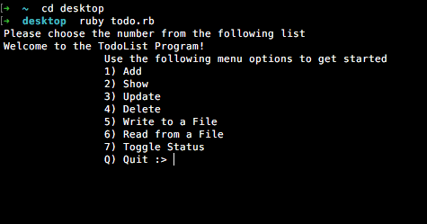
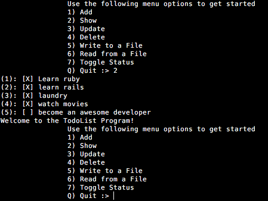
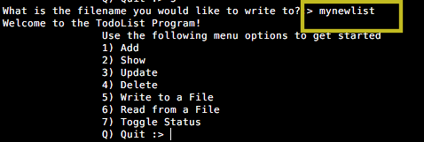
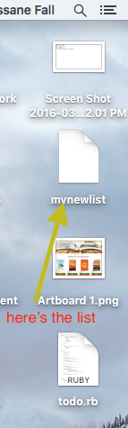
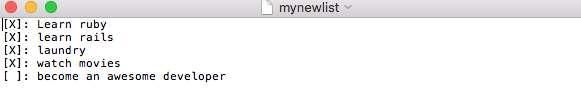

# Ruby Command-Line Todo-List
### Increase Your productivity using the command-line todo app.
#### One File. One Terminal. Complete todo-list.
##### Get started with simple, easy steps!
1. In order to use the Ruby todo app in the terminal, make sure to have ruby installed.  

	a. To install RVM, type this in your terminal  
  	`$ \curl -L https://get.rvm.io | bash -s stable`  
  	b. Close your terminal and then re-open it. Now, lets see if RVM was loaded properly:  
  	`$ rvm | head -n 1`  
  	c. Now install Ruby with:  
  		1) $ rvm use ruby --install --default  
		2) $ ruby -v  

2. Download the todo.rb file  
  a. Put file in any directory(preferably desktop)
  b. Open todo.rb through terminal using "ruby todo.rb". The app will run and display options

  

#### Save your new list of tasks  

3. Follow the instructions. Once all tasks have been made, it's recommended to save the  
   list of tasks using "steps 4"
	- naming a file that doesn't exist will be created for you within the same directory.  
	  

	  

	- You list is saved into a new file. Either open it in TextEdit or other text editors  
	
	_Here's an example of how I set up mine_
	  

	  

#### You can read the tasks from your existing file  

#### Additional Note:  

**That's it! You're ready to be more productive with this ruby-terminal doto app.**

_This is an open source app that can be modified/customized by the user._

